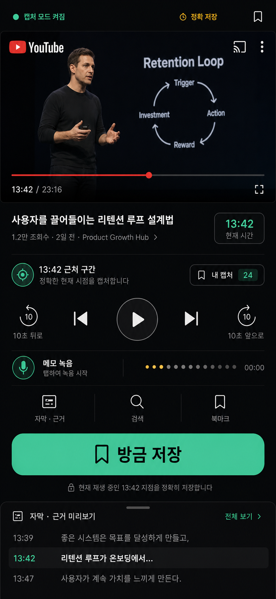
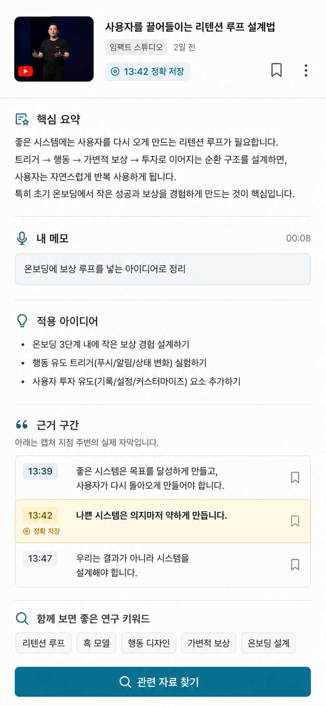
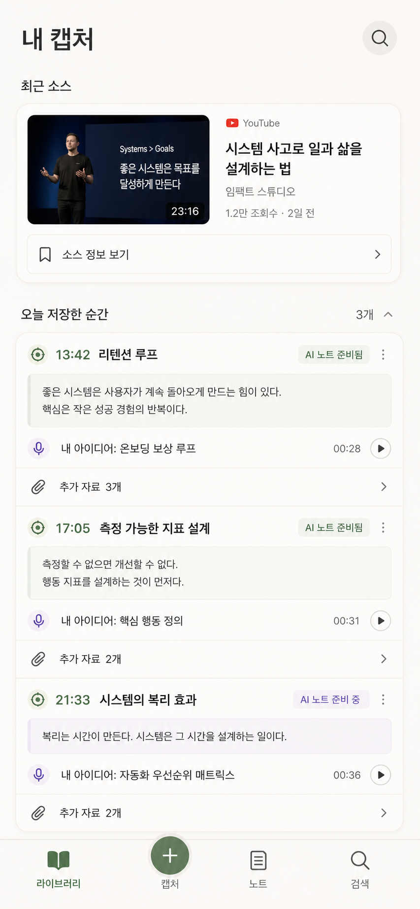

# Design Visuals

Status: Neo Brutalism selected for MVP1; local full-app review board available
Last updated: 2026-06-15

This file preserves the three visual directions generated during the `product-ideation-workflow` design stage.

Local review board:

- Open [design-review.html](design-review.html) in a browser to review the current Neo Brutalism MVP1 full-app screen inventory.
- Use this local board as the active design-review surface until Figma MCP limits reset.
- MVP1 design lock uses Neo Brutalism, Block Lime `#dceeb1`, and product-facing language such as `이 부분 저장`, `방금 저장`, and `내 생각 말하기`.

Figma import status:

- Authentication verified for `hrs` / `gyqlswh112@gmail.com`.
- Created Figma design file: <https://www.figma.com/design/YrXzABrnjTPhpoPt9Szykn>
- Blocked at asset upload: Figma MCP returned the Starter plan tool-call limit.
- Existing Cal AI file also tested: <https://www.figma.com/design/Sr0MXFZ5U6kOk69lcqu5Je/Cal-AI-Trust-First-Nutrition-App---MVP-Screens>
- Both asset upload and editable-frame creation in the existing file are blocked by the same Starter MCP tool-call limit.
- Once the limit resets or the plan is upgraded, place these three concepts side by side in the existing Cal AI file under a `Note AI - UI Direction Comparison` page.

## MVP1 Design Lock

User-selected direction:

```txt
Neo Brutalism
```

Current implementation reference:

- [design-review.html](design-review.html)
- Root [DESIGN.md](../DESIGN.md)

Five-loop design process reflected in the current board:

1. Style lock
   - Adopt Neo Brutalism for MVP1.
2. Flow map
   - Simplify to `로그인 -> 영상 가져오기 -> 듣기 -> 이 부분 저장 -> 내 생각 말하기 -> 노트 -> 자료`.
3. Screen inventory
   - Define the full app screens and each major button destination.
4. Usability pass
   - Keep one dominant action per moving-context screen.
5. Implementation audit
   - Convert the visual direction into tokens, components, states, and screen contracts in `DESIGN.md`.

Full app screens in the active local board:

1. `Welcome`
2. `Permission Setup`
3. `Home`
4. `Import Video`
5. `Source Processing`
6. `Listen / Save`
7. `Voice Memo`
8. `Note Processing`
9. `Note Detail`
10. `Research`
11. `Library / Search`
12. `Settings`

MVP1 final visual rules:

- Thick black borders.
- Hard offset black shadows.
- Block Lime `#dceeb1` for primary actions and state cards.
- Cream/paper base.
- Product-facing CTA: `이 부분 저장` / `방금 저장`.
- Avoid `캡처` as primary UI text.

## Round 3 Active Directions

User feedback applied:

- `캡처` is not intuitive enough for Korean user-facing UI.
- The service should avoid feeling like an AI-generated generic screen.
- The design should reference current UI/UX styles, but still fit a moving-context knowledge capture product.
- Run an explicit improvement loop before locking a direction.

Four-loop process reflected in [design-review.html](design-review.html):

1. Language loop
   - Replace `캡처` with `방금 저장`, `듣던 부분`, `내 생각 추가`, and `노트로 정리됨`.
2. Flow loop
   - Compress the core flow to `듣기 -> 방금 저장 -> 생각 말하기`.
3. Style loop
   - Compare five UI styles: Editorial Minimal, Bento Knowledge, Neo Brutalism, Liquid Glass, and Material Expressive.
4. Self-audit loop
   - Check readability, thumb reach, product fit, non-AI polish, and implementation realism.

Previous Round 3 recommendation before user selection:

```txt
Primary style: Editorial Minimal
Primary CTA language: 방금 저장 / 듣던 부분 저장
Signature color: Block Lime #dceeb1
Use Block Lime for action and state, not as a full-screen wash.
```

Five style versions in the active board:

1. `Editorial Minimal`
   - Recommended default.
   - Best for home, note review, evidence-backed knowledge.
2. `Bento Knowledge`
   - Best for modular note/result surfaces.
   - Must be tightly limited to avoid dashboard complexity.
3. `Bold Save / Neo Brutalism`
   - Useful as a brand stress test.
   - Too loud for the default reading experience.
4. `Native Glass / Liquid Glass`
   - Useful for native overlay moments.
   - Risky if transparency harms readability.
5. `Friendly Utility / Material Expressive`
   - Useful for friendlier onboarding and empty states.
   - Risky if it weakens serious knowledge-tool trust.

## Round 2 Active Directions

User feedback applied:

- Use Block Lime `#dceeb1` as the main color.
- Drop the previous dark A direction because readability was too low.
- Use B as the main direction.
- Keep only the useful parts of C: private memory and low organization burden.
- Reduce functional complexity and make the UI more intuitive.

Current local board directions:

1. `Lime Capture Note`
   - Best for MVP1 playback/capture.
   - One visible source, one clear timestamp state, one primary `방금 저장` action.
2. `Evidence Note Home`
   - Current recommended main direction.
   - Best for home/generated note review with Block Lime hero note and evidence-backed sections.
3. `Simple Memory Stack`
   - Best for library/review.
   - Keeps saved moments easy to revisit without making organization feel like work.

Current recommendation:

```txt
Main/Home/Note: Evidence Note Home
Capture: Lime Capture Note
Library: Simple Memory Stack
```

## A. Listening Console



Best use:

- MVP1 player/capture screen.
- Moving context.
- Exact timestamp capture.

Design read:

- Dark-first, playback-centered.
- Large bottom capture action.
- Strong mint capture accent.
- Transcript evidence visible but secondary.

Keep:

- Thumb-friendly `방금 저장` button.
- Explicit `정확 저장` timestamp state.
- Player remains visible.

Watch:

- Do not let the app feel like a podcast clone.
- Keep note/research pathways visible enough after capture.

## B. Evidence Notebook



Best use:

- Note detail.
- AI-generated Korean note.
- Timestamp/transcript trust.
- Research handoff.

Design read:

- Light-first, calm, readable.
- Source thumbnail and exact timestamp at top.
- Structured note sections.
- Transcript evidence highlighted in pale yellow.

Keep:

- `핵심 요약`, `내 메모`, `적용 아이디어`, `근거 구간`.
- Search keywords and `관련 자료 찾기` CTA.
- Evidence as first-class UI, not hidden metadata.

Watch:

- May feel desk-oriented unless paired with a stronger capture screen.

## C. Private Memory



Best use:

- Library.
- Saved captures review.
- Low-organization personal knowledge space.

Design read:

- Quiet, personal, low-friction.
- Soft off-white background.
- Sage and muted violet accents.
- Captures grouped by source and moment.

Keep:

- `오늘 저장한 순간` grouped rows.
- User memo preview.
- AI note readiness and research count.
- Bottom capture tab as central action.

Watch:

- Could feel too passive if capture urgency is not strong enough.

## Recommended System Direction

Use all three, but assign them by surface:

```txt
Player/Capture: Listening Console
Note Detail: Evidence Notebook
Library/Review: Private Memory
```

This creates one coherent product system:

- dark, high-contrast capture when the user is moving;
- light, trustworthy reading when the user reviews notes;
- quiet personal library for saved ideas.

## Figma Board Layout

When Figma is available, create:

- Page: `MVP1 UI Directions`
- Section: `Direction Comparison`
- Three 390 x 844 mobile frames:
  - `A - Listening Console`
  - `B - Evidence Notebook`
  - `C - Private Memory`
- One comparison panel with:
  - Core use case.
  - Palette.
  - Strength.
  - Risk.
  - Recommendation.

Decision question:

```txt
Should MVP1 use the recommended mixed system, or should one direction dominate every screen?
```
